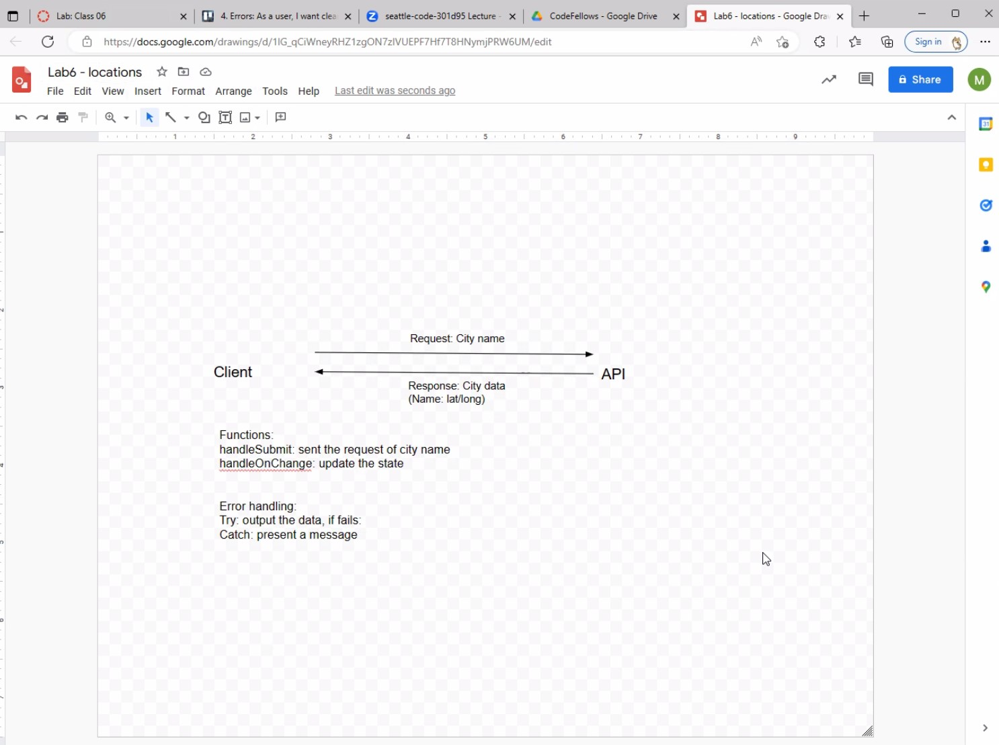

# City-Explorer

**Author**: Cody Lobdell
**Version**: 2.0.0 (increment the patch/fix version number if you make more commits past your first submission)

## Overview
This page is used for finding the approximate location of a city. The results contain the latitude and logitude as well!

## Getting Started
The web page incorporates the React App, React Bootstrap and Axios. All of these MUST be installed prior to intializing the deployed site!

## Architecture
Axios, LocationIQ, and Netlify were are directly associated with the architecture of the live site.

## Change Log
03-07-2023 12:23pm - Application is now fully-functional, with supporting city-search form!

## Credit and Collaborations
Credit to Miranda Lu for the WRRC diagram

# Name of feature
"City-Explorer"

# Estimate of time needed to complete
Three Hours

# Start time
March 6th, 2023 @1341

# Finish time
March 7th, 2023 @1223

# Actual time needed to complete
6-7 Hours

## WRRC

